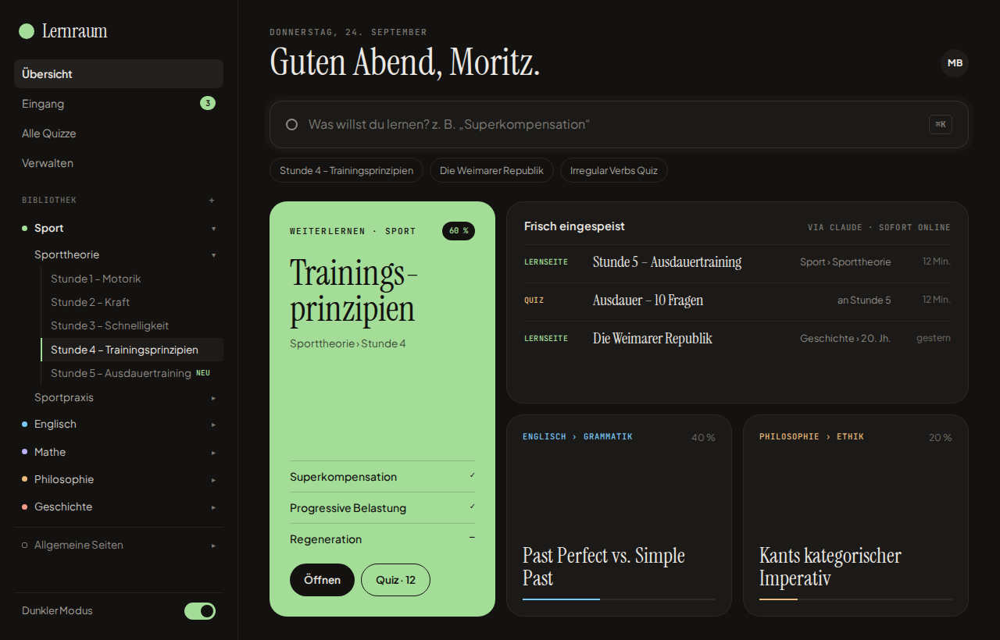
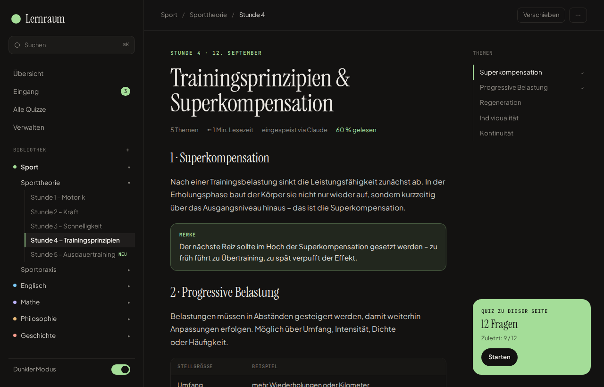
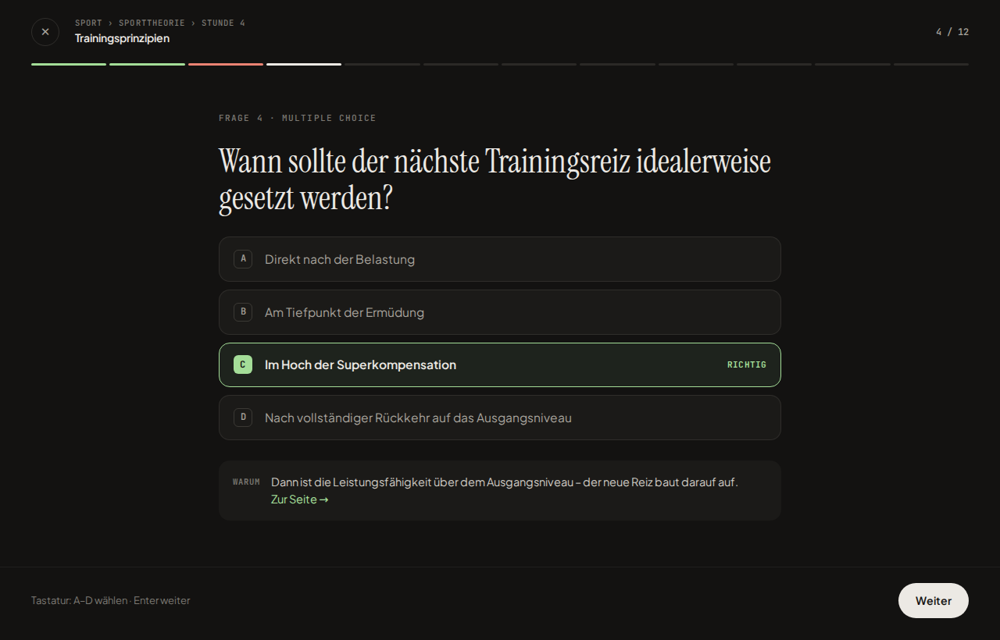
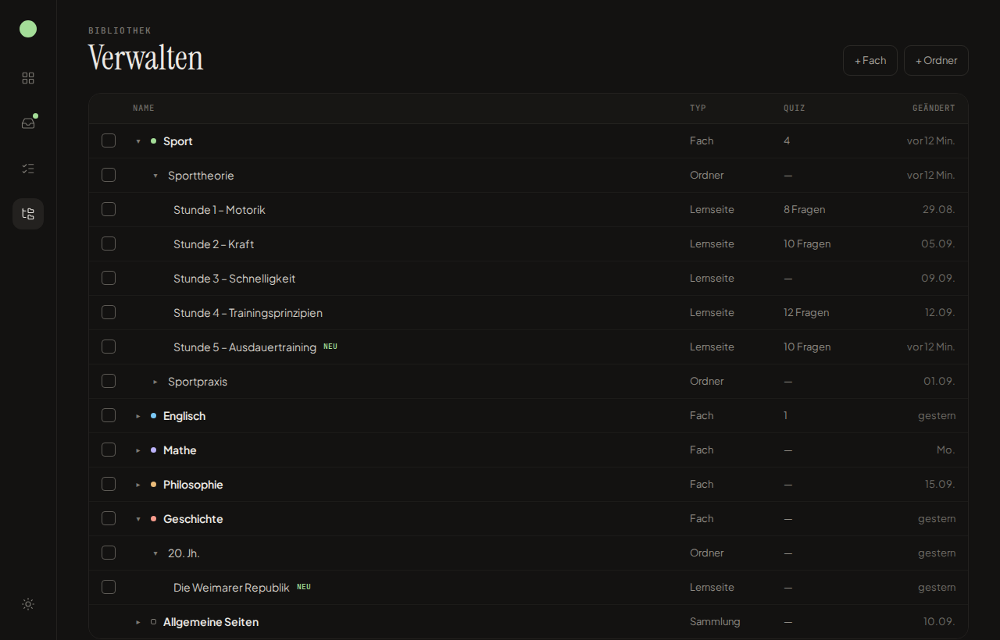
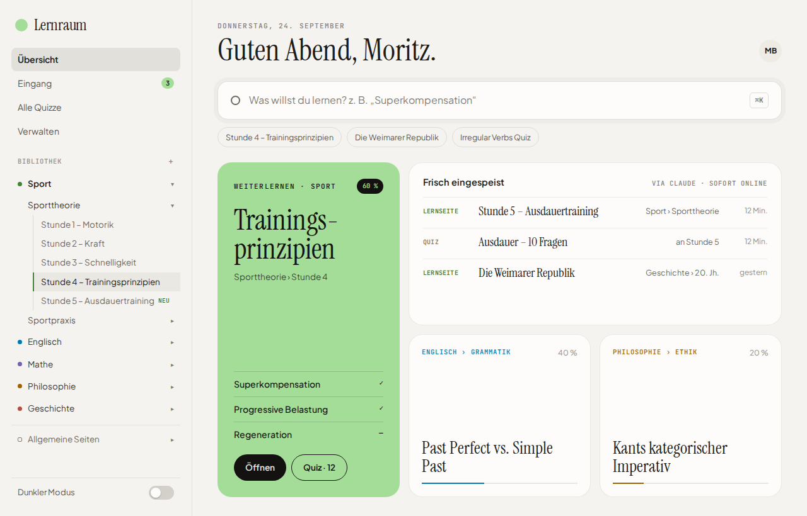
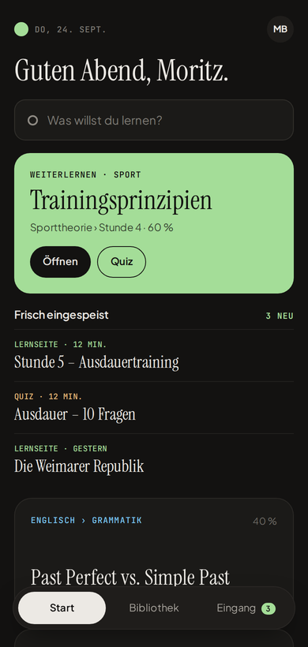

# Lernraum

Persönliches Lerntool für Fächer, Lernseiten und Quizze – **eingespeist von Claude, sofort online** auf dem eigenen Server.



## Was der Lernraum kann

- **Fächer → Ordner → Lernseiten** in beliebiger Tiefe (z. B. *Sport › Sporttheorie › Stunde 1–5*) plus **allgemeine Seiten** ohne Fach
- **Lernseiten** mit Themen (Inhaltsverzeichnis mit Scroll-Spy), **Lesefortschritt pro Thema**, Merke-/Definition-/Beispiel-/Tipp-/Achtung-Blöcken, Tabellen, Formeln (KaTeX), Diagrammen (Mermaid) und aufklappbaren Lösungen
- **Quizze** (Multiple Choice, Wahr/Falsch, Freitext): im Fokusmodus mit Tastatur spielen, Ergebnis speichern, falsche Fragen wiederholen; Fragen korrigieren, umsortieren, löschen – aber nicht in der Oberfläche erstellen
- **Eingang** für alles, was Claude einspeist (Badge in der Seitenleiste, aktualisiert sich live)
- **Verwalten**: Baumtabelle mit Drag & Drop, Mehrfachauswahl, „Verschieben nach…“, Umbenennen, Löschen mit 10-Sekunden-Rückgängig, „+ Fach“ und „+ Ordner“
- **⌘K-Suche** über Titel, Themen und Inhalte (SQLite FTS5, findet auch Wortteile)
- **Dunkler Modus als Standard**, heller Modus per Schalter; Desktop und Mobil
- **Claude-Anbindung** per MCP-Connector (OAuth-Login) oder REST-API

| Lernseite | Quiz | Verwalten |
|---|---|---|
|  |  |  |

| Heller Modus | Mobil |
|---|---|
|  |  |

## So kommt ein Lernzettel in den Lernraum

```
Du ──(Foto/PDF/Text)──► Claude ──(MCP: ingest_page)──► Lernraum ──► sofort online + im Eingang
                          ▲                                 │
                          └──────(list_tree / get_page)─────┘
```

1. Lernzettel in den Chat geben: „Speise das in Sport › Sporttheorie ein.“
2. Claude liest die bestehende Struktur, wandelt den Zettel in Lernraum-Markdown um, erstellt ein Quiz und speist beides ein.
3. Claude antwortet mit dem Link – die Seite ist sofort erreichbar.

Details: [Claude verbinden](docs/CLAUDE_VERBINDEN.md) · [Inhaltsformat](docs/CONTENT_FORMAT.md)

## Auf den Server bringen

Hostinger-VPS mit laufendem Traefik (z. B. n8n-Vorlage) → **[docs/DEPLOY.md](docs/DEPLOY.md)**. Kurzfassung:

```bash
git clone https://github.com/moritzbibow/lernraum.git && cd lernraum
./scripts/setup-vps.sh          # erkennt Traefik, fragt Domain + Passwort, schreibt .env
./scripts/deploy.sh             # baut, startet hinter Traefik (HTTPS) und prüft die Erreichbarkeit – auch für Updates
```

## Lokal entwickeln

```bash
npm install
npm run dev                     # http://localhost:3000 – Passwort in der Entwicklung: lernraum
```

Demo-Inhalte aus den Mockups (braucht einen API-Token):

```bash
LERNRAUM_API_TOKEN=dev-token-1234567890 npm run dev          # Terminal 1
LERNRAUM_API_TOKEN=dev-token-1234567890 npm run seed:demo -- --progress   # Terminal 2
```

| Befehl | Zweck |
|---|---|
| `npm run dev` / `build` / `start` | Next.js |
| `npm test` | Unit-Tests (Vitest) |
| `npm run test:e2e` | End-to-End-Tests (Playwright, baut und startet die App selbst) |
| `node tests/integration/mcp-oauth.mjs` | MCP + OAuth gegen eine laufende Instanz (offizieller SDK-Client) |
| `npm run lint` / `typecheck` | ESLint / TypeScript |
| `npm run db:generate` | Neue Migration aus `lib/db/schema.ts` erzeugen |
| `npm run docs:format` | `docs/CONTENT_FORMAT.md` aus `lib/content/format-guide.ts` neu erzeugen |

## Architektur

| Bereich | Umsetzung |
|---|---|
| App | Next.js 16 (App Router, React 19, TypeScript), `output: standalone` |
| Daten | SQLite (better-sqlite3, WAL) + Drizzle ORM, Migrationen in `drizzle/`, FTS5-Suche |
| Inhalte | Markdown → remark/rehype (GFM, KaTeX, eigene Blöcke, Sanitizing), Themen aus `##` |
| Claude | MCP-Server (Streamable HTTP) + OAuth 2.1 (DCR, PKCE) · REST-API mit Bearer-Token |
| Auth | Ein Passwort → signiertes Session-Cookie; Rate-Limits |
| Betrieb | Docker, Traefik-Labels, nächtliches SQLite-Backup, JSON-Export |

**Ein Verhalten, drei Zugänge:** Die gesamte Fachlogik liegt in `lib/services/`. Die Oberfläche (Server Actions in `lib/actions/`), die REST-API (`app/api/`) und der MCP-Server (`lib/mcp/`) rufen dieselben Funktionen auf – z. B. läuft jedes Einspeisen durch `lib/services/ingest.ts` (transaktional, mit Validierung und verständlichen Fehlermeldungen für Claude).

```
app/            Seiten & Routen (main = Sidebar, focus = Icon-Rail, play = Vollbild-Quiz, api, oauth)
components/     UI (CSS-Module nach den Design-Tokens in app/globals.css)
lib/services/   Fachlogik: ingest, library/tree, manage, quizzes, inbox, search, views, maintenance
lib/content/    Markdown-Pipeline, Block-Registry, Inhaltsformat
lib/auth/       Session, API-Auth, OAuth-Server
lib/mcp/        MCP-Tools
drizzle/        SQL-Migrationen
design/         Original-Design-Handoff (Claude Design)
docs/           Deployment, Claude-Anbindung, Inhaltsformat, Claude-Skill
```

**Neue Inhaltsblöcke** (z. B. `:::vokabel`): Eintrag in `lib/content/blocks.ts`, Stil in `app/prose.css`, fertig – das Inhaltsformat für Claude aktualisiert sich automatisch.

## Design

Umsetzung des Design-Handoffs in [`design/`](design/) (Screens 2a und 3a–3d, pixelgenau). Der helle Modus folgt der Vorgabe aus dem Handoff: Tokens invertiert, Akzentfarben für Text und Linien auf ~0.55 Helligkeit abgesenkt.
